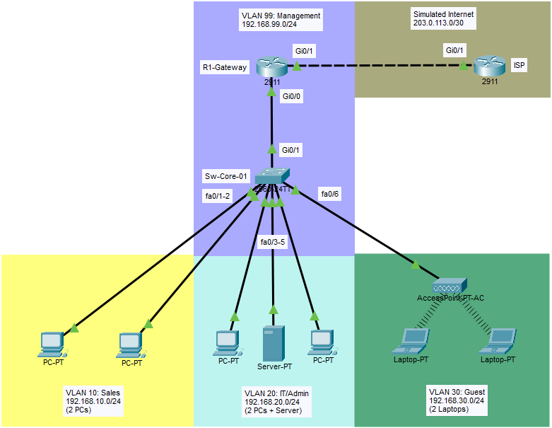

# Lab 1: Secure VLAN Design with ACLs and Port Security

## 🎯 Objective
Design and implement a secure multi-VLAN network with:
- Network segmentation (VLANs)
- Inter-VLAN routing (Router-on-a-Stick)
- Access control (Standard & Extended ACLs)
- Port security (MAC address filtering, violation modes)
- DHCP snooping (prevent rogue DHCP servers)
- Best practices (native VLAN change, unused port shutdown)

**Real-World Scenario:** Small business with 3 departments needs secure network segmentation to comply with data protection regulations.

## 🔧 Equipment Used
- 2 Cisco Router (Router0:Gateway and Router1:ISP) - 1841 or 2911
- 1 Cisco Switch (Switch0) - 2960
- 1 Server (DHCP Server)
- 6 PCs (2 per department)
- Software: Cisco Packet Tracer 9.0.0

## 📋 Network Design

### Network Topology



*Figure 1: Complete network topology with VLANs, router-on-a-stick, and security features*

### Topology Details
```
                    Router1 (ISP)
                          |
                    Gi 0/1: Internet/WAN
                          |
                    Router0 (R1-Gatway)
                          |
                    Gi0/0 (DHCP Client)
                          |
                    Gig0/1 (Trunk)
                          |
                    Switch0 (Sw-Core-01)
         _________________|_________________
        |                 |                 |
    [VLAN 10]         [VLAN 20]         [VLAN 30]
     Sales             IT/Admin          Guest
   (2 PCs)           (2 PCs + Server)   (2 PCs)
```

### IP Addressing Scheme

| VLAN | Name | Network | Gateway | DHCP Pool | Purpose |
|------|------|---------|---------|-----------|---------|
| 10 | Sales | 192.168.10.0/24 | .1 | .10-.50 | Sales department workstations |
| 20 | IT | 192.168.20.0/24 | .1 | .10-.50 | IT staff + servers (most privileged) |
| 30 | Guest | 192.168.30.0/24 | .1 | .10-.100 | Guest WiFi (internet only) |
| 99 | Management | 192.168.99.0/24 | .1 | Static | Switch management (security) |
| - | Router WAN | 203.0.113.2/30 | Static | Realistic Internet Simulation |
| - | ISP | 203.0.113.1/30 | Static | Realistic Internet Simulation |

### Security Requirements

**Access Control:**
- ✅ IT VLAN can access all VLANs (full network management)
- ✅ Sales VLAN can access internet only (no access to IT/Guest)
- ✅ Guest VLAN can access internet only (no access to internal networks)
- ❌ Sales cannot access IT VLAN
- ❌ Guest cannot access Sales or IT VLANs
- ❌ No one can access Management VLAN except IT

**Port Security:**
- Maximum 2 MAC addresses per access port
- Violation mode: Shutdown (security)
- Sticky MAC learning (persistence)

**Additional Security:**
- DHCP snooping enabled (prevent rogue DHCP)
- Native VLAN changed from default (VLAN 1)
- Unused ports shutdown
- Management VLAN separate from data

---

## ⚙️ Configuration Steps

### PHASE 1: BASIC VLAN SETUP

#### Step 1: Create VLANs on Switch
```cisco
Switch> enable
Switch# configure terminal

! Create VLANs
Switch(config)# vlan 10
Switch(config-vlan)# name Sales
Switch(config-vlan)# exit

Switch(config)# vlan 20
Switch(config-vlan)# name IT
Switch(config-vlan)# exit

Switch(config)# vlan 30
Switch(config-vlan)# name Guest
Switch(config-vlan)# exit

Switch(config)# vlan 99
Switch(config-vlan)# name Management
Switch(config-vlan)# exit

! Verify VLANs created
Switch# show vlan brief

VLAN Name                             Status    Ports
---- -------------------------------- --------- -------------------------------
1    default                          active    Gig0/2
10   Sales                            active    Fa0/1, Fa0/2
20   IT                               active    Fa0/3, Fa0/4, Fa0/5
30   Guest                            active    Fa0/6, Fa0/7
99   Management                       active    
999  VLAN0999                         active    Fa0/8, Fa0/9, Fa0/10, Fa0/11
                                                Fa0/12, Fa0/13, Fa0/14, Fa0/15
                                                Fa0/16, Fa0/17, Fa0/18, Fa0/19
                                                Fa0/20, Fa0/21, Fa0/22, Fa0/23
                                                Fa0/24
1002 fddi-default                     active    
1003 token-ring-default               active    
1004 fddinet-default                  active    
1005 trnet-default                    active 
```

#### Step 2: Assign Access Ports to VLANs
```cisco
! Sales VLAN (Fa0/1-2)
Switch(config)# interface range fa0/1-2
Switch(config-if-range)# switchport mode access
Switch(config-if-range)# switchport access vlan 10
Switch(config-if-range)# spanning-tree portfast
Switch(config-if-range)# exit

! IT VLAN (Fa0/3-5) - includes DHCP server on Fa0/5
Switch(config)# interface range fa0/3-5
Switch(config-if-range)# switchport mode access
Switch(config-if-range)# switchport access vlan 20
Switch(config-if-range)# spanning-tree portfast
Switch(config-if-range)# exit

! Guest VLAN (Fa0/6-7)
Switch(config)# interface range fa0/6-7
Switch(config-if-range)# switchport mode access
Switch(config-if-range)# switchport access vlan 30
Switch(config-if-range)# spanning-tree portfast
Switch(config-if-range)# exit
```

#### Step 3: Configure Trunk Port with Security
```cisco
! Configure trunk to router
Switch(config)# interface gig0/1
Switch(config-if)# switchport mode trunk

! SECURITY: Change native VLAN (prevent VLAN hopping)
Switch(config-if)# switchport trunk native vlan 999

! SECURITY: Explicitly allow only VLANs in use
Switch(config-if)# switchport trunk allowed vlan 10,20,30,99

! Disable DTP (security - manual trunk config only)
Switch(config-if)# switchport nonegotiate
Switch(config-if)# exit
```

**Why this matters:** Default native VLAN 1 is a security risk. Attackers can exploit VLAN hopping attacks if native VLAN is not changed.

#### Step 4: Shutdown Unused Ports (Security Best Practice)
```cisco
! Shutdown all unused ports (Fa0/8-24)
Switch(config)# interface range fa0/8-24
Switch(config-if-range)# shutdown
Switch(config-if-range)# switchport mode access
Switch(config-if-range)# switchport access vlan 999
Switch(config-if-range)# exit
```

**Why this matters:** Unused ports are entry points for attackers. Always shut them down.

---

### PHASE 2: PORT SECURITY CONFIGURATION

#### Step 5: Enable Port Security on All Access Ports
```cisco
! Sales VLAN ports (Fa0/1-2)
Switch(config)# interface range fa0/1-2
Switch(config-if-range)# switchport port-security
Switch(config-if-range)# switchport port-security maximum 2
Switch(config-if-range)# switchport port-security violation shutdown
Switch(config-if-range)# switchport port-security mac-address sticky
Switch(config-if-range)# exit

! IT VLAN ports (Fa0/3-4) - workstations only, not server
Switch(config)# interface range fa0/3-4
Switch(config-if-range)# switchport port-security
Switch(config-if-range)# switchport port-security maximum 2
Switch(config-if-range)# switchport port-security violation shutdown
Switch(config-if-range)# switchport port-security mac-address sticky
Switch(config-if-range)# exit

! Server port (Fa0/5) - allow only 1 MAC (the server)
Switch(config)# interface fa0/5
Switch(config-if)# switchport port-security
Switch(config-if)# switchport port-security maximum 1
Switch(config-if)# switchport port-security violation shutdown
Switch(config-if)# switchport port-security mac-address sticky
Switch(config-if)# exit

! Guest VLAN ports (Fa0/6-7)
Switch(config)# interface range fa0/6-7
Switch(config-if-range)# switchport port-security
Switch(config-if-range)# switchport port-security maximum 2
Switch(config-if-range)# switchport port-security violation restrict
Switch(config-if-range)# switchport port-security mac-address sticky
Switch(config-if-range)# exit
```

**Port Security Modes Explained:**
- **Maximum 2:** Allows laptop + docking station or phone
- **Violation shutdown:** Disables port if violation (secure, but requires manual intervention)
- **Violation restrict:** Drops violating packets but keeps port up (Guest network = less disruption)
- **Sticky MAC:** Learns and saves MAC addresses dynamically

#### Step 6: Verify Port Security
```cisco
Switch# show port-security interface fa0/1
Port Security              : Enabled
Port Status                : Secure-up
Violation Mode             : Shutdown
Maximum MAC Addresses      : 2
Total MAC Addresses        : 1
Configured MAC Addresses   : 0
Sticky MAC Addresses       : 1
Security Violation Count   : 0

Switch# show port-security address
               Secure Mac Address Table
-----------------------------------------------------------------------------
Vlan    Mac Address       Type                Ports   Remaining Age
                                                          (mins)
----    -----------       ----                -----   -------------
  10    0001.9641.2D01    SecureSticky        Fa0/1        -
```

---

### PHASE 3: DHCP SNOOPING (PREVENT ROGUE DHCP)

#### Step 7: Enable DHCP Snooping
```cisco
! Enable DHCP snooping globally
Switch(config)# ip dhcp snooping

! Enable DHCP snooping on VLANs
Switch(config)# ip dhcp snooping vlan 10,20,30

! Set trusted port (where legitimate DHCP server connects)
Switch(config)# interface fa0/5
Switch(config-if)# ip dhcp snooping trust
Switch(config-if)# exit

! Set trusted port (uplink to router)
Switch(config)# interface gig0/1
Switch(config-if)# ip dhcp snooping trust
Switch(config-if)# exit
```

**Why this matters:** Without DHCP snooping, anyone can plug in a rogue DHCP server and hijack network traffic (man-in-the-middle attack).

#### Step 8: Verify DHCP Snooping
```cisco
Switch# show ip dhcp snooping
Switch DHCP snooping is enabled
DHCP snooping is configured on following VLANs:
10,20,30

Interface                  Trusted    Rate limit (pps)
-----------------------    -------    ----------------
FastEthernet0/5            yes        unlimited
GigabitEthernet0/1         yes        unlimited
```

---

### PHASE 4: ROUTER CONFIGURATION (INTER-VLAN ROUTING + ISP ROUTER)

#### Step 9: Configure Router Subinterfaces
```cisco
Router> enable
Router# configure terminal

! Configure subinterface for Sales VLAN
Router(config)# interface gig0/0.10
Router(config-subif)# encapsulation dot1Q 10
Router(config-subif)# ip address 192.168.10.1 255.255.255.0
Router(config-subif)# exit

! Configure subinterface for IT VLAN
Router(config)# interface gig0/0.20
Router(config-subif)# encapsulation dot1Q 20
Router(config-subif)# ip address 192.168.20.1 255.255.255.0
Router(config-subif)# exit

! Configure subinterface for Guest VLAN
Router(config)# interface gig0/0.30
Router(config-subif)# encapsulation dot1Q 30
Router(config-subif)# ip address 192.168.30.1 255.255.255.0
Router(config-subif)# exit

! Configure subinterface for Management VLAN
Router(config)# interface gig0/0.99
Router(config-subif)# encapsulation dot1Q 99
Router(config-subif)# ip address 192.168.99.1 255.255.255.0
Router(config-subif)# exit

! Enable physical interface
Router(config)# interface gig0/0
Router(config-if)# no shutdown
Router(config-if)# exit
```
#### Step 10: Configure IP Helper-Address (DHCP Relay)
```cisco
Router(config)# interface gig0/0.10
Router(config-if)# ip helper-address 192.168.20.10

Router(config)# interface gig0/0.30
Router(config-if)# ip helper-address 192.168.20.10
```
**Why needed:**
- DHCP server is in VLAN 20 (IT)
- VLANs 10 (Sales) and 30 (Guest) are different broadcast domains
- DHCP broadcasts don't cross VLANs by default
- Router must relay DHCP requests from Sales/Guest to server

#### Step 11: Configure Gateway and ISP Router (Realistic Internet Simulation)
##### On R1 (Main Router):
```cisco
Router(config)# hostname R1-Gateway
R1-Gateway(config)# interface Gi0/1
R1-Gateway(config-if)# ip address 203.0.113.2 255.255.255.252
R1-Gateway(config-if)# no shutdown

R1-Gateway(config)# ip route 0.0.0.0 0.0.0.0 203.0.113.1
```
##### On ISP Router
```cisco
Router(config)# hostname ISP
ISP(config)# interface Gi0/1
ISP(config-if)# ip address 203.0.113.1 255.255.255.252
ISP(config-if)# no shutdown

ISP(config)# interface loopback 0
ISP(config-if)# ip address 8.8.8.8 255.255.255.255

ISP(config)# ip route 192.168.10.0 255.255.255.0 203.0.113.2
ISP(config)# ip route 192.168.20.0 255.255.255.0 203.0.113.2
ISP(config)# ip route 192.168.30.0 255.255.255.0 203.0.113.2
ISP(config)# ip route 192.168.99.0 255.255.255.0 203.0.113.2
```
**Why needed:**
- More realistic WAN simulation
- Demonstrates default route configuration
- Shows return routing (ISP needs routes back to LANs)
---- 
### PHASE 5: ACCESS CONTROL LISTS (ACLs)

#### Step 12: Create ACLs for Inter-VLAN Security
```cisco
! ===== ACL 110: Sales VLAN Restrictions =====
! Allow Sales to access internet (simulated as 8.8.8.8)
! Deny Sales from accessing IT VLAN
! Deny Sales from accessing Guest VLAN
! Deny Sales from accessing Management VLAN

R1-Gateway(config)# access-list 110 remark === Sales VLAN Access Control ===

! Allow web browsing (Established = return TCP traffic)
R1-Gateway(config)# access-list 110 permit tcp any 192.168.10.0 0.0.0.255 established

! Allow ping (Echo = ping request/Echo-reply = ping response)
R1-Gateway(config)# access-list 110 permit icmp any 192.168.10.0 0.0.0.255 echo
R1-Gateway(config)# access-list 110 permit icmp any 192.168.10.0 0.0.0.255 echo-reply
R1-Gateway(config)# access-list 110 permit icmp 192.168.10.0 0.0.0.255 any echo

! Allow DNS (required for internet)
R1-Gateway(config)# access-list 110 permit udp 192.168.10.0 0.0.0.255 any eq 53

! Allow HTTP/HTTPS (internet access)
R1-Gateway(config)# access-list 110 permit tcp 192.168.10.0 0.0.0.255 any eq 80
R1-Gateway(config)# access-list 110 permit tcp 192.168.10.0 0.0.0.255 any eq 443

! Deny access to IT VLAN
R1-Gateway(config)# access-list 110 deny ip 192.168.10.0 0.0.0.255 192.168.20.0 0.0.0.255

! Deny access to Guest VLAN
R1-Gateway(config)# access-list 110 deny ip 192.168.10.0 0.0.0.255 192.168.30.0 0.0.0.255

! Deny access to Management VLAN
R1-Gateway(config)# access-list 110 deny ip 192.168.10.0 0.0.0.255 192.168.99.0 0.0.0.255

! Permit other traffic (internet)
R1-Gateway(config)# access-list 110 permit ip 192.168.10.0 0.0.0.255 any
```
```cisco
! ===== ACL 120: Guest VLAN Restrictions =====
! Allow Guest to access internet ONLY
! Deny all internal network access

R1-Gateway(config)# access-list 120 remark === Guest VLAN Access Control ===

! Allow web browsing (Established = return TCP traffic)
R1-Gateway(config)# access-list 120 permit tcp any 192.168.30.0 0.0.0.255 established

! Allow ping (Echo = ping request/Echo-reply = ping response)
R1-Gateway(config)# access-list 120 permit icmp any 192.168.30.0 0.0.0.255 echo
R1-Gateway(config)# access-list 120 permit icmp any 192.168.30.0 0.0.0.255 echo-reply
R1-Gateway(config)# access-list 120 permit icmp 192.168.30.0 0.0.0.255 any echo

! Allow DNS
R1-Gateway(config)# access-list 120 permit udp 192.168.30.0 0.0.0.255 any eq 53

! Allow HTTP/HTTPS
R1-Gateway(config)# access-list 120 permit tcp 192.168.30.0 0.0.0.255 any eq 80
R1-Gateway(config)# access-list 120 permit tcp 192.168.30.0 0.0.0.255 any eq 443

! Deny access to all internal VLANs (10.0.0.0/8, 172.16.0.0/12, 192.168.0.0/16)
R1-Gateway(config)# access-list 120 deny ip 192.168.30.0 0.0.0.255 10.0.0.0 0.255.255.255
R1-Gateway(config)# access-list 120 deny ip 192.168.30.0 0.0.0.255 172.16.0.0 0.15.255.255
R1-Gateway(config)# access-list 120 deny ip 192.168.30.0 0.0.0.255 192.168.0.0 0.0.255.255

! Permit internet (public IPs)
R1-Gateway(config)# access-list 120 permit ip 192.168.30.0 0.0.0.255 any
```
```cisco
! ===== ACL 130: Management VLAN Protection =====
! Allow ONLY IT VLAN to access Management VLAN
! Deny all other VLANs

Router(config)# access-list 130 remark === Management VLAN Protection ===

! Allow IT VLAN to access Management VLAN (SSH, SNMP)
R1-Gateway(config)# access-list 130 permit icmp any 192.168.20.0 0.0.0.255 echo-reply
R1-Gateway(config)# access-list 130 permit tcp 192.168.20.0 0.0.0.255 192.168.99.0 0.0.0.255 eq 22
R1-Gateway(config)# access-list 130 permit udp 192.168.20.0 0.0.0.255 192.168.99.0 0.0.0.255 eq 161

! Deny Sales to IT and Guest
R1-Gateway(config)# deny ip 192.168.10.0 0.0.0.255 192.168.20.0 0.0.0.255
R1-Gateway(config)# deny ip 192.168.10.0 0.0.0.255 192.168.30.0 0.0.0.255

! Deny Guest to IT and Sales
R1-Gateway(config)# deny ip 192.168.30.0 0.0.0.255 192.168.20.0 0.0.0.255
R1-Gateway(config)# deny ip 192.168.30.0 0.0.0.255 192.168.10.0 0.0.0.255

! Deny everyone else
R1-Gateway(config)# access-list 130 deny ip any 192.168.99.0 0.0.0.255

! Permit all other traffic
R1-Gateway(config)# access-list 130 permit ip any any
```

#### Step 13: Apply ACLs to Subinterfaces
```cisco
! Apply ACL to Sales VLAN (outbound)
R1-Gateway(config)# interface gig0/0.10
R1-Gateway(config-subif)# ip access-group 110 out
R1-Gateway(config-subif)# exit

! Apply ACL to Guest VLAN (outbound)
R1-Gateway(config)# interface gig0/0.30
R1-Gateway(config-subif)# ip access-group 120 out
R1-Gateway(config-subif)# exit

! Apply ACL to protect Management VLAN (inbound on all subinterfaces)
R1-Gateway(config)# interface gig0/0.10
R1-Gateway(config-subif)# ip access-group 130 in
R1-Gateway(config-subif)# exit

R1-Gateway(config)# interface gig0/0.30
R1-Gateway(config-subif)# ip access-group 130 in
R1-Gateway(config-subif)# exit
```

#### Step 14: Verify ACL Configuration
```cisco
R1-Gateway# show access-lists 110
Extended IP access list 110
    permit tcp any 192.168.10.0 0.0.0.255 established
    permit icmp any 192.168.10.0 0.0.0.255 echo
    permit icmp any 192.168.10.0 0.0.0.255 echo-reply
    permit icmp 192.168.10.0 0.0.0.255 any echo
    permit udp 192.168.10.0 0.0.0.255 any eq domain
    permit tcp 192.168.10.0 0.0.0.255 any eq www
    permit tcp 192.168.10.0 0.0.0.255 any eq 443
    deny ip 192.168.10.0 0.0.0.255 192.168.20.0 0.0.0.255
    deny ip 192.168.10.0 0.0.0.255 192.168.30.0 0.0.0.255
    deny ip 192.168.10.0 0.0.0.255 192.168.99.0 0.0.0.255
    permit ip 192.168.10.0 0.0.0.255 any

R1-Gateway# show ip interface gig0/0.10 | include access list
  Outgoing access list is 110
  Inbound  access list is 130

R1-Gatway#show access-lists 120
Extended IP access list 120
    permit tcp any 192.168.30.0 0.0.0.255 established
    permit icmp any 192.168.30.0 0.0.0.255 echo
    permit icmp any 192.168.30.0 0.0.0.255 echo-reply
    permit icmp 192.168.30.0 0.0.0.255 any echo
    permit udp 192.168.30.0 0.0.0.255 any eq domain
    permit tcp 192.168.30.0 0.0.0.255 any eq www
    permit tcp 192.168.30.0 0.0.0.255 any eq 443
    deny ip 192.168.30.0 0.0.0.255 10.0.0.0 0.255.255.255
    deny ip 192.168.30.0 0.0.0.255 172.16.0.0 0.15.255.255
    deny ip 192.168.30.0 0.0.0.255 192.168.0.0 0.0.255.255
    permit ip 192.168.30.0 0.0.0.255 any

R1-Gatway#show ip int g0/0.20 | include access list
  Outgoing access list is not set
  Inbound  access list is not set

R1-Gatway#show access-lists 130
Extended IP access list 130
    permit tcp 192.168.20.0 0.0.0.255 192.168.99.0 0.0.0.255 eq 22
    permit udp 192.168.20.0 0.0.0.255 192.168.99.0 0.0.0.255 eq snmp
    permit icmp any 192.168.20.0 0.0.0.255 echo-reply 
    deny ip 192.168.10.0 0.0.0.255 192.168.20.0 0.0.0.255 
    deny ip 192.168.10.0 0.0.0.255 192.168.30.0 0.0.0.255
    deny ip 192.168.30.0 0.0.0.255 192.168.20.0 0.0.0.255
    deny ip 192.168.30.0 0.0.0.255 192.168.10.0 0.0.0.255
    deny ip any 192.168.99.0 0.0.0.255 
    permit ip any any

R1-Gatway#show ip int g0/0.30 | include access list
  Outgoing access list is 120
  Inbound  access list is 130
```
---

### PHASE 6: CONFIGURE DHCP SERVER

#### Step 15: Configure DHCP Pools on Server
**DHCP Server Static IP Configuration:**
1. Click Server → Desktop → IP Configuration
- Select: Static
- IP Address: 192.168.20.10
- Subnet Mask: 255.255.255.0
- Default Gateway: 192.168.20.1
  
**Server GUI Configuration:**
1. Click Server → Services → DHCP
2. Create 3 pools:

**Pool 1: Sales VLAN**
- Pool Name: Sales_Pool
- Default Gateway: 192.168.10.1
- DNS Server: 8.8.8.8
- Start IP: 192.168.10.10
- Subnet Mask: 255.255.255.0
- Maximum Users: 40

**Pool 2: IT VLAN**
- Pool Name: IT_Pool
- Default Gateway: 192.168.20.1
- DNS Server: 8.8.8.8
- Start IP: 192.168.20.11
- Subnet Mask: 255.255.255.0
- Maximum Users: 40

**Pool 3: Guest VLAN**
- Pool Name: Guest_Pool
- Default Gateway: 192.168.30.1
- DNS Server: 8.8.8.8
- Start IP: 192.168.30.10
- Subnet Mask: 255.255.255.0
- Maximum Users: 90
  
**Why needed:**
- DHCP servers MUST have static IPs (infrastructure requirement)
- Can't serve DHCP if the server itself needs DHCP (chicken-egg problem)
---
### PHASE 7: CONFIGURE MANAGEMENT & SECURE SSH

#### Step 16: Assign Management IP and SSH On Switch
```cisco
Switch> enable
Switch# configure terminal

! ========================================
! Step 1: Set hostname and domain
! ========================================
Switch(config)# hostname SW-Core-01
SW-Core-01(config)# ip domain-name company.local

! ========================================
! Step 2: Create privileged user account
! ========================================
! Username: admin
! Password: Str0ngP@ss! (encrypted with secret)
! Privilege: 15 (full access, same as enable)
SW-Core-01(config)# username admin privilege 15 secret Str0ngP@ss!

! Optional: Create read-only user (privilege 1)
SW-Core-01(config)# username readonly privilege 1 secret R3adOnly!

! ========================================
! Step 3: Set enable secret (backup)
! ========================================
SW-Core-01(config)# enable secret En@bl3P@ss!

! ========================================
! Step 4: Generate RSA keys for SSH
! ========================================
SW-Core-01(config)# crypto key generate rsa
How many bits in the modulus [512]: 2048
% Generating 2048 bit RSA keys, keys will be non-exportable...

! ========================================
! Step 5: Configure SSH version 2 only
! ========================================
SW-Core-01(config)# ip ssh version 2
SW-Core-01(config)# ip ssh time-out 60
SW-Core-01(config)# ip ssh authentication-retries 3

! ========================================
! Step 6: Configure VTY lines for SSH
! ========================================
SW-Core-01(config)# line vty 0 15
SW-Core-01(config-line)# login local
SW-Core-01(config-line)# transport input ssh
SW-Core-01(config-line)# exec-timeout 10 0
SW-Core-01(config-line)# exit

! ========================================
! Step 7: Disable Telnet (console only)
! ========================================
SW-Core-01(config)# line vty 0 15
SW-Core-01(config-line)# transport input ssh
SW-Core-01(config-line)# exit

! ========================================
! Step 8: Secure console access
! ========================================
SW-Core-01(config)# line console 0
SW-Core-01(config-line)# login local
SW-Core-01(config-line)# exec-timeout 10 0
SW-Core-01(config-line)# logging synchronous
SW-Core-01(config-line)# exit

! ========================================
! Step 9: SAVE CONFIGURATION
! ========================================
SW-Core-01# copy running-config startup-config
```
#### Step 17: Assign Management IP and SSH On Router
```cisco
Router> enable
Router# configure terminal

! ========================================
! Step 1: Set hostname and domain
! ========================================
R1-Gateway(config)# hostname R1-Gateway
R1-Gateway(config)# ip domain-name company.local

! ========================================
! Step 2: Create privileged user accounts
! ========================================
R1-Gateway(config)# username admin privilege 15 secret Str0ngP@ss!
R1-Gateway(config)# username netadmin privilege 15 secret N3t@dm1n!

! Optional: Read-only user
R1-Gateway(config)# username readonly privilege 1 secret R3adOnly!

! ========================================
! Step 3: Set enable secret
! ========================================
R1-Gateway(config)# enable secret En@bl3P@ss!

! ========================================
! Step 4: Generate RSA keys
! ========================================
R1-Gateway(config)# crypto key generate rsa
How many bits in the modulus [512]: 2048

! ========================================
! Step 5: Configure SSH
! ========================================
R1-Gateway(config)# ip ssh version 2
R1-Gateway(config)# ip ssh time-out 60
R1-Gateway(config)# ip ssh authentication-retries 3

! ========================================
! Step 6: Configure VTY lines
! ========================================
R1-Gateway(config)# line vty 0 4
R1-Gateway(config-line)# login local
R1-Gateway(config-line)# transport input ssh
R1-Gateway(config-line)# exec-timeout 10 0
R1-Gateway(config-line)# exit

! ========================================
! Step 7: Secure console
! ========================================
R1-Gateway(config)# line console 0
R1-Gateway(config-line)# login local
R1-Gateway(config-line)# password C0ns0l3P@ss!
R1-Gateway(config-line)# exec-timeout 10 0
R1-Gateway(config-line)# logging synchronous
R1-Gateway(config-line)# exit

! ========================================
! Step 8: SAVE
! ========================================
R1-Gateway# copy running-config startup-config
```
---

## ✅ Testing & Verification

### Test 1: VLAN Isolation

**From Sales PC (192.168.10.10):**
```
C:\> ping 192.168.10.11
Reply from 192.168.10.11: bytes=32 time<1ms TTL=128
✅ SUCCESS - Same VLAN communication works
```

### Test 2: Inter-VLAN Routing (Allowed)

**From IT PC (192.168.20.11):**
```
C:\> ping 192.168.10.10
Reply from 192.168.10.10: bytes=32 time=2ms TTL=127
✅ SUCCESS - IT can access Sales VLAN
```

### Test 3: ACL Blocking Sales → IT

**From Sales PC (192.168.10.10):**
```
C:\> ping 192.168.20.10
destination host unreachable
✅ SUCCESS - ACL correctly blocks Sales from accessing IT VLAN
```

**Verify on Router:**
```cisco
Router# show access-lists 110
Extended IP access list 110
    40 deny ip 192.168.10.0 0.0.0.255 192.168.20.0 0.0.0.255 (8 matches)
```

### Test 4: Guest Isolation (Internet Only)

**From Guest PC (192.168.30.10):**
```
C:\> ping 192.168.10.10
destination host unreachable
✅ SUCCESS - Guest cannot access Sales VLAN

C:\> ping 8.8.8.8
Reply from 8.8.8.8: bytes=32 time=15ms TTL=118
✅ SUCCESS - Guest CAN access internet
```

### Test 5: Port Security Violation

**Test on Sales PC port (Fa0/1):**

1. Disconnect PC0
2. Connect two different PCs to Fa0/1 (Maximum 2 MAC addresses per access port)
3. Port shuts down automatically

**Verify on Switch:**
```cisco
Switch# show port-security interface fa0/1
Port Security              : Enabled
Port Status                : Secure-shutdown
Violation Mode             : Shutdown
Security Violation Count   : 1
```

**To recover:**
```cisco
Switch(config)# interface fa0/1
Switch(config-if)# shutdown
Switch(config-if)# no shutdown
```

### Test 6: Testing SSH Access

**From IT PC (192.168.20.11) (Privilege 15 User):**
```
C:\> ssh -l admin@192.168.99.10
Password: Str0ngP@ss!
SW-Core-01#  ← Notice # prompt (privileged mode immediately!)

C:\> ssh -l admin@192.168.99.1
Password: Str0ngP@ss!
R1-Gateway#  ← Notice # prompt (privileged mode immediately!)
✅ SUCCESS - IT VLAN can SSH to switch and router in admin 
```

**From IT PC (192.168.20.11) (Read-Only User):**
```
C:\> ssh -l readonly 192.168.99.10
Password: R3adOnly!
SW-Core-01>  ← Notice > prompt (user mode)

C:\> ssh -l readonly 192.168.99.1
Password: R3adOnly!
R1-Gateway>  ← Notice > prompt (user mode)
✅ SUCCESS - IT VLAN can SSH to switch and router in read-only
```

**From Sales PC (192.168.10.10):**
```
C:\> ssh admin@192.168.99.10
Request timed out.
✅ SUCCESS - Sales blocked from management
```
---

## 🐛 Troubleshooting Issues I Encountered

### Problem 1: All PCs Have APIPA Addresses

**Symptom:**
```
All PCs: 169.254.x.x
```

**Root Cause:** DHCP server itself had APIPA address (was set to obtain IP via DHCP)

**Debugging Steps:**
1. Checked DHCP service - ON ✅
2. Checked DHCP pools - configured ✅
3. Checked switch port - in correct VLAN ✅
4. Checked server IP - **APIPA!** ❌

**Solution:** Configured server with static IP (192.168.20.10)

**Result:** Server got valid IP, but PCs in VLANs 10/30 still got APIPA

---

### Problem 2: VLAN 20 DHCP Works, VLAN 10/30 Fails**

**Symptom:**
```
IT PC (VLAN 20): 192.168.20.11 ✅
Sales PC (VLAN 10): 169.254.x.x ❌
Guest PC (VLAN 30): 169.254.x.x ❌
```

**Root Cause:** DHCP broadcasts don't cross VLANs, need relay

**Debugging Steps:**
1. Verified server can ping gateway - works ✅
2. Verified server in VLAN 20 - correct ✅
3. Realized: Sales/Guest in different VLANs - need helper address!

**Solution:**
```cisco
Router(config)# interface gig0/0.10
Router(config-if)# ip helper-address 192.168.20.10

Router(config)# interface gig0/0.30
Router(config-if)# ip helper-address 192.168.20.10
```
**Result:** All PCs now get DHCP addresses ✅

---
### Problem 3: No Internet Access (8.8.8.8 Unreachable)

**Symptom:**
```
C:\> ping 8.8.8.8
Destination host unreachable
```

**Root Cause:** No route to internet/no internet simulation

**Debugging Steps:**

1. Checked PC can ping gateway - works ✅
2. Checked router has route to 8.8.8.8 - none! ❌

**Solution:**
- Added ISP router
- Configured WAN link (203.0.113.0/30)
- Added default route on R1
- Added return routes on ISP

**Result:** All PCs can ping 8.8.8.8 ✅

---
### Problem 4: IT Can Ping Sales/Guest, But No Reply

**Symptom (Simulation Mode):**
```
IT PC → Switch → Router → Switch → Sales PC [GREEN]
Sales PC → Switch → Router [GREEN then RED X]
Router → Switch → Sales PC [RED]
```

**Root Cause:** ACL 110/120 blocking ICMP echo-reply packets
**Debugging Steps:**

1- Verified ACLs applied correctly - yes
2- Traced packet in simulation mode - found block point!
3- Checked ACL rules - missing ICMP permits

**Solution:**
```cisco
! ACL 110 - allow ping TO Sales
access-list 110 permit icmp any 192.168.10.0 0.0.0.255 echo
access-list 110 permit icmp any 192.168.10.0 0.0.0.255 echo-reply

! ACL 120 - allow ping TO Guest  
access-list 120 permit icmp any 192.168.30.0 0.0.0.255 echo
access-list 120 permit icmp any 192.168.30.0 0.0.0.255 echo-reply

! ACL 130 - allow ping replies TO IT
access-list 130 permit icmp any 192.168.20.0 0.0.0.255 echo-reply
```

**Result:** IT can now ping Sales and Guest, receives replies ✅

**Key Insight:** ACLs are stateless - must permit BOTH directions

---
### Problem 5: SSH Works But Can't Enter Privileged Mode

**Symptom:**
```
C:\> ssh -l admin 192.168.99.10
Password: ****
SW-Core-01> enable
% No password set
```
**Root Cause:** No enable secret configured, no privilege 15 users
**Debugging Steps:**

1. SSH connection works - authentication OK ✅
2. enable fails - no password set ❌

**Solution:**
```cisco

! Create privilege 15 user (direct privileged access)
Switch(config)# username admin privilege 15 secret Str0ngP@ss!

! Add enable secret (backup method)
Switch(config)# enable secret En@bl3P@ss!

! Configure VTY for local authentication
Switch(config)# line vty 0 15
Switch(config-line)# login local
```
**Result:** SSH login with admin goes directly to privileged mode ✅

---

## 📝 Key Takeaways

### 📋 Security Principles Demonstrated

✅ **Defense in Depth:** Multiple security layers (VLANs + ACLs + Port Security + DHCP Snooping)

✅ **Least Privilege:** Each VLAN has minimum necessary access

✅ **Network Segmentation:** Separate VLANs for different security zones

✅ **Attack Surface Reduction:** Unused ports shutdown, native VLAN changed, DTP disabled

### 📋 Security Best Practices Summary

| Practice | Configuration | Why |
|----------|---------------|-----|
| Strong passwords | 12+ chars, mixed case, numbers, symbols | Prevent brute force |
| Privilege levels | privilege 15 for admins, 1 for read-only | Least privilege principle | 
| Enable secret | enable secret NOT enable password | MD5 encryption | 
| SSHv2 only | ip ssh version 2 | SSHv1 has vulnerabilities | 
| Disable Telnet | transport input ssh | Telnet is plaintext | 
| RSA 2048 bits | crypto key generate rsa 2048 | Industry standard | 
| Auto-logout | exec-timeout 10 0 | Prevent unauthorized access | 
| Login local | login local | User accountability | 
| Limit retries | ip ssh authentication-retries 3 | Slow brute force | 
| Console security | line console 0 + login local | Physical access control |

### 📋 Technical Skills Showcased

| Skill | Implementation |
|-------|----------------|
| VLAN Design | 4 VLANs with logical segmentation |
| Inter-VLAN Routing | Router-on-a-stick with subinterfaces |
| DHCP Server | Configuration and Relay |
| Access Control | Extended ACLs with with bidirectional traffic control |
| Port Security | MAC filtering, violation modes, sticky learning |
| DHCP Security | Snooping to prevent rogue DHCP servers |
| Switch Hardening | Unused port shutdown, native VLAN change |
| Secure Management | SSH Security Configuration, separate management VLAN |
| Troubleshooting | Systematic troubleshooting methodology, Packet-level debugging |
| Security-first network design | Defense in Depth, Least Privilege, Network Segmentation, Attack Surface Reduction |

### Real-World Application

This lab demonstrates enterprise security for:
- Small business (10-50 employees)
- Compliance requirements (PCI-DSS, HIPAA)
- Guest WiFi implementation
- BYOD environments

---

## 🔗 Related Concepts

### What I Learned

**VLAN Security:**
- VLAN hopping attacks (double-tagging, switch spoofing)
- Private VLANs (further isolation)
- Dynamic VLAN assignment (802.1X with RADIUS)

**ACL Best Practices:**
- Named ACLs vs numbered (named = easier to modify)
- Remarks for documentation
- Log keyword for monitoring

**Port Security Modes:**
- Protect (drops silently)
- Restrict (drops + logs)
- Shutdown (disables port - most secure)

**DHCP Attacks:**
- DHCP starvation
- Rogue DHCP server
- DHCP snooping database

### Skills to Build Next

1. 802.1X Network Access Control (NAC)
2. Dynamic ARP Inspection (DAI)
3. IP Source Guard
4. Private VLANs
5. VLAN Access Control Lists (VACLs)

### Career Relevance

**Roles this prepares you for:**
- Network Security Engineer
- Network Administrator
- Junior Network Engineer
- NOC Technician
- Systems Administrator

**Interview questions answered:**
- "How would you secure guest WiFi?"
- "Explain VLAN hopping prevention."
- "Walk through port security implementation."
- "How do you prevent rogue DHCP servers?"
- "Troubleshooting inter-VLAN routing process?"

---

## 🔗 Related Labs

- [Lab 2: Site-to-Site VPN with IPsec](../vpn/lab02-site-to-site-vpn.md) - Coming next
- [Lab 3: 802.1X Network Access Control](../security/lab03-802.1x-nac.md) - Future
- [Lab 4: OSPF Multi-Area Design](../routing/lab04-ospf-multi-area.md) - Future

---

## 📚 Resources

**Cisco Documentation:**
- [VLAN Configuration Guide](https://www.cisco.com/c/en/us/td/docs/switches/lan/catalyst2960/software/release/12-2_55_se/configuration/guide/scg_2960/swvlan.html)
- [Port Security Configuration](https://www.cisco.com/c/en/us/td/docs/switches/lan/catalyst3750x_3560x/software/release/12-2_55_se/configuration/guide/3750xscg/swtrafc.html)
- [DHCP Snooping Configuration](https://www.cisco.com/c/en/us/td/docs/switches/lan/catalyst2960/software/release/12-2_55_se/configuration/guide/scg_2960/swdhcp82.html)

**Security Standards:**
- NIST Cybersecurity Framework
- CIS Cisco IOS Benchmarks

---

**Lab Completed:** February 2026  
**Source:** Custom lab combining Network+ and CCNA Security concepts  
**Time Spent:** 4 hours (including security hardening and troubleshooting)  
**Difficulty:** Intermediate

